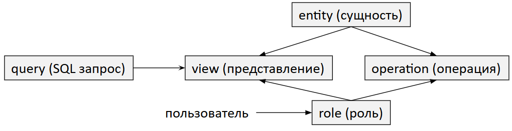
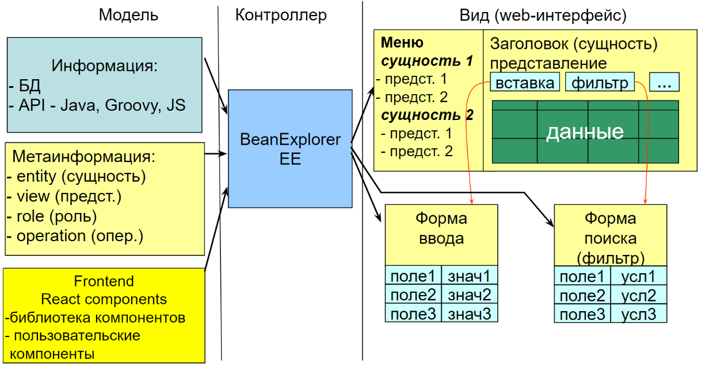

Основные концепции
******************

BeanExplorer Enterprise Edition - это технология для автоматической генерации интерфейса пользователя
на основе модели предметной области. 

Модель предметной области задается в виде структуры базы данных, используя ER (entity-relationship) подход.

Структура такой базы данных также может быть представлена в виде ER-диаграмм. 

В данной документации описывается BeanExplorer Enterprise Edition version 5, сокращенно be5. 

Основные элементы ER-модели
===========================

* entity (cущность) - объект или понятие, о котором нужно хранить информацию (например, «Клиент», «Заказ», «Товар»). 
  На диаграмме обычно изображается в виде прямоугольника.

* атрибут - свойство или характеристика сущности (например, для сущности «Клиент» это могут быть «Имя», «Телефон», «Адрес»).

* связь - ассоциация или отношение между двумя (или более) сущностями (например, «Клиент» размещает «Заказ»). 
  На диаграмме связь изображается в виде ромба, соединяющего сущности.

Основные концепции
==================

* **entity** – соответствует понятию класса/типа в объектно-ориентированном подходе.
  Представлена в виде таблицы базы данных.
  
* **view** – форма представления entity. Entity может иметь несколько разных способов представления.

* **query** – как правило с каждым view ассоциирован SQL запрос, используемый для генерации данного view.

* **operation** – операция для работы с данными, как правило представляется в виде кнопки,
  например, кнопки “Вставить”, Редактировать”, “Удалить”, “Фильтр”.
  Операция может быть выполнена сама по себе (например, операции “Вставка”, “Фильтр”)
  или она может быть применена к выделенному набору записей (например, операция “Удалить”).
   
* **role** – каждый пользователь при авторизации получает свою роль. 
  Для каждой роли определено определены набор доступных views и operations.

 
Архитектура приложения
======================

    
be5 приложение построено на основе патерна MVC - Model-View-Controller

* **Model** включает:

 * база данных - содержит модель предметной области;

 * be5 проект - добавляет мета-информацию к базе данных, включая определение сущностей, представлений, операций и ролей.
   Проект также включает Java/Groovy код для операций, локализацию и пользовательские React компоненты.

* **Controller** - be5 выполняет роль контролера, который:
 
 * генерирует представление на основе модели;
  
 * изменяет модель на основе событий от представления.    

* **View** - вид приложения в браузере. Состоит из набора React компонентов для представления:

 * меню - генерируется автоматически на основе фильтра представлений и операций по ролям пользователя;
  
 * таблица - представление результата SQL запросов в виде таблицы. be5 view также включает пользовательские
   формы для фильтров, название view, кнопки операций, навигацию по страницам.
  
 * формы операций - для создания и редактирования записей в базе данных.

         
    
 
  